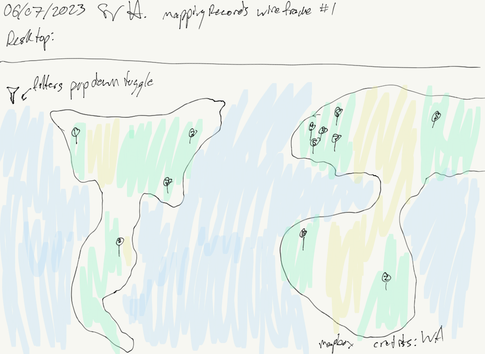
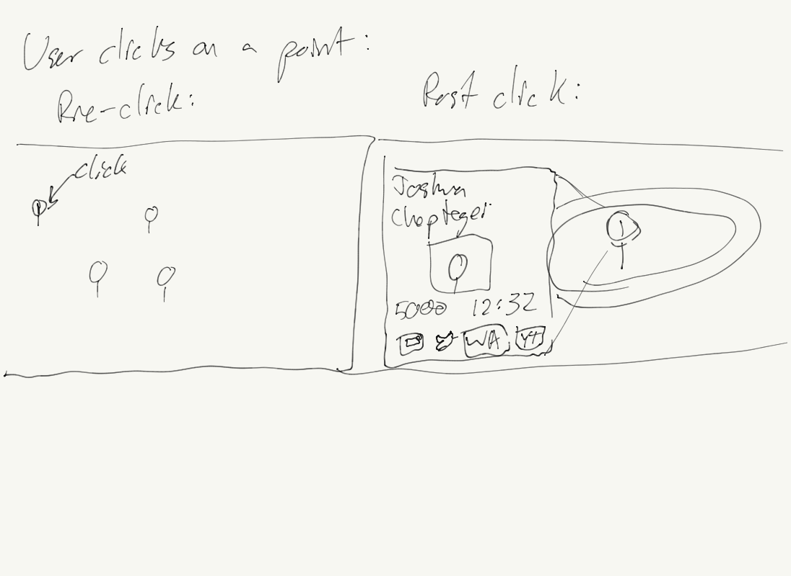

# trackingRecords
Web map showing the locations of the top ten performances in each Athletics event.

## Original Sketch

## Basic Functionalities

## Future Versions
**v1.0 Proof of Concept**
- Display simple data: name, event, mark. At location
- Default pins for each point
- Only do outdoor Olympic contested events

**v1.1 Add Basic Functionality**
- Add detailed information about the mark upon click
- Add a filter by event function
- Change default zoom location
- Map Background color
- Add user control buttons
- Make good looking css

**v1.2 Make Accessable**
- Host on Google

**v2.0 Logical Refinements**
- Only get the top ten individuals/teams of each event, no repeat people
- Get the pins to be at the actual track

**v2.1 Add performance details**
- Get more data on the athletes, webscrape their WA page
- Make the detailed version of the mark contain more of this data

**v2.2 Representative Pins**
- Change the pins to have an overlay of performance rank
- Differentiate the pins of different events
- Differentiate the pins for male/female

**v2.3 Filer**
- Add filter by sex
- Add filter by decade

**v3.0 Make Personable**
- Add in athlete social media links
- Add in YouTube video of the performance
- Add in link to World Athletics profile

**v4.0 Expand Scope**
- Add indoor events

## Credit
Samuel Affolder 2023